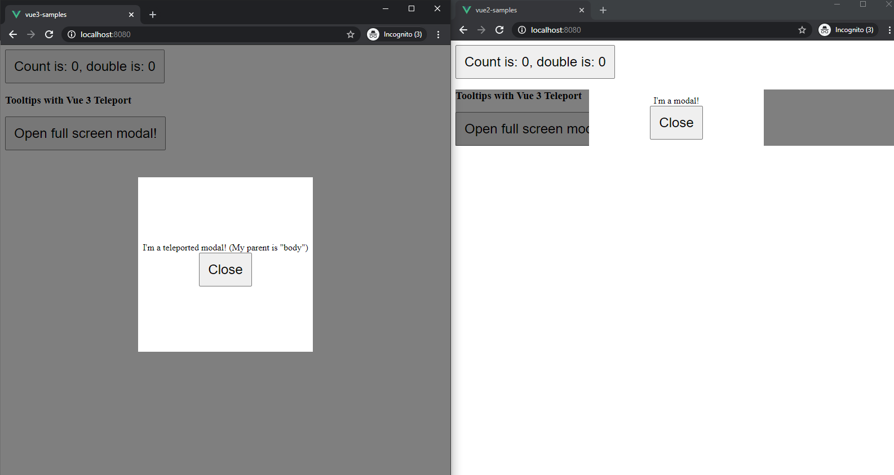
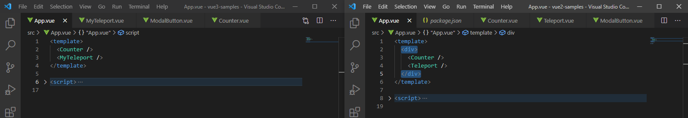

# Migrating from Vue2.x to Vue3.x

## Reasons to Upgrade:
- Better imports: Any code that isn't needed is excluded via tree shaking
- Better Virtual DOM: Diffing algorithm meaning faster rendering times.
- Composition API which leads to better scaling.
- Teleport component
- Multi-Root components
- Typescript compatibility

## Needed Software:
- vue-cli: https://cli.vuejs.org/

## Notable New Features:
- Composition API:  
> Large components are difficult to understand and maintain. The separation of options (data, watch, computed, methods) obscures the underlying logical concerns. In addition, when working on a single logical concern, we have to constantly "jump" around option blocks for the relevant code. The Composition API enables us to place code related to the same logical concern.


---
- Teleport:  
> The common scenario for Teleporting is creating a component that includes a full-screen modal. In most cases, you'd want the modal's logic to live within the component, but the positioning of the modal quickly becomes difficult to solve through CSS, or requires a change in component composition.




---

- Fragments:  
> In Vue 3, components now have official support for multi-root node components, i.e., fragments. In 2.x, multi-root components were not supported and would emit a warning when a user accidentally created one. As a result, many components are wrapped in a single ```<div>``` in order to fix this error. In 3.x, components now can have multiple root nodes. However, this does require developers to explicitly define where attributes should be distributed.



---

- State-driven CSS Variables (v-bind in ```<style>```):  
```vue
<template>
    <div class="text">hello</div>
</template>
<script>
    export default {
        data() {
            return {
                color: 'red',
                font: {
                    size: '2em',
                },
            }
        },
    }
</script>
<style>
    .text {
        color: v-bind(color);
        /* expressions (wrap in quotes) */
        font-size: v-bind('font.size');
    }
</style>
```

---

- SFC ```<style scoped>``` can now include global rules or rules that target only slotted content:  
> Motivation: Vue SFC scoped styles makes the CSS apply to the current component only. There are a number of cases that users commonly run into that can be improved.

~~<style>~~  
&nbsp;&nbsp;&nbsp;~~/deep/ .v-toolbar__extension {~~   
&nbsp;&nbsp;&nbsp;~~padding: 0px !important;~~   
&nbsp;&nbsp;&nbsp;~~}~~   
~~</style>~~  

```html
    <style scoped>
        /* deep selectors */
        ::v-deep(.foo) {}
        /* shorthand */
        :deep(.foo) {}

        /* targeting slot content */
        ::v-slotted(.foo) {}
        /* shorthand */
        :slotted(.foo) {}

        /* one-off global rule */
        ::v-global(.foo) {}
        /* shorthand */
        :global(.foo) {}
    </style>
```

---

- Suspense:  
> It is common for components to need to perform some kind of asynchronous request before they can be rendered properly. Components often handle this locally and in many cases that is a perfectly good approach. The ```<suspense>``` component provides an alternative, allowing for the waiting to be handled further up the component tree rather than in each individual component.

```vue
    <template>
        <suspense>
            <template #default>
                <TodoList />
            </template>
            <template #fallback>
                <div>
                    Loading...
                </div>
            </template>
        </suspense>
    </template>

    <script>
        export default {
            components: {
                TodoList: defineAsyncComponent(() => import('./TodoList.vue'))
            }
        }
    </script>
```

---

## Vue 3.x Breaking Changes In Current Front-End Project(s):
> The following may not include all breaking changes. It is recommended to develop in Microsoft Visual Studio Code with the Vetur extension installed.

- Global API Tree shaking; Global and internal APIs have been restructured to be tree-shakable
> Module bundlers like webpack support tree-shaking, which is a fancy term for "dead code elimination". Unfortunately, due to how the code is written in previous Vue versions, global APIs like (Vue.nextTick() aka this.$nextTick()) are not tree-shakable and will be included in the final bundle regardless of where they are actually used or not.

~~this.$nextTick()~~
```js
import {nextTick} from 'vue';
nextTick();
```

> List of global APIs in Vue 2.x in our current project that are affected by this change: Vue.nextTick aka this.$nextTick, Vue.set aka wrapper.vm.$set


---


- v-model
> With Vue 3, the API for two-way data binding is being standardized in order to reduce confusion and to allow developers more flexibility with the v-model directive. Check the codebase for .sync usage and replace it with v-model.

~~```<ChildComponent :title.sync="pageTitle" />```~~  
```<ChildComponent v-model:title="pageTitle" />```  

> For all v-models without arguments, make sure to change props and events name to modelValue and update:modelValue respectively.

```vue
<template>
    <ChildComponent v-model="pageTitle" />
</template>
<script>
export default {
    props: {
        modelValue: String // previously was `value: String`
    },
    emits: ['update:modelValue'],
    methods: {
        changePageTitle(title) {
            this.$emit('update:modelValue', title) // previously was `this.$emit('input', title)`
        }
    }
};
</script>
```

---


- v-bind merge behavior
> Order of bindings for v-bind will affect the rendering result. If you are relying on this override functionality for v-bind, we currently recommend ensuring that your v-bind attribute is defined before individual properties.
```html
<!-- template -->
<div id="red" v-bind="{ id: 'blue' }"></div>
<!-- result -->
<div id="blue"></div>

<!-- template -->
<div v-bind="{ id: 'blue' }" id="red"></div>
<!-- result -->
<div id="red"></div>
```
---


- emits option
> It is highly recommended that you document all of the events emitted by each of your components using emits. This is especially important because of the removal of the .native modifier. Any listeners for events that aren't declared with emits will now be included in the component's $attrs, which by default will be bound to the component's root node.
```vue
<template>
    <div>
        <p>{{ text }}</p>
        <button v-on:click="$emit('accepted')">OK</button>
    </div>
</template>
<script>
    export default {
        props: ['text'],
        emits: ['accepted']
    };
</script>
```

---        

- The beforeDestroy lifecycle option has been renamed to beforeUnmount.

---


- data option
> In 2.x, developers could define the data option with either an object or a function. Though this provided some convenience in terms of root instances having a shared state, this has led to confusion due to the fact that its only possible on the root instance. In 3.x, the data option has been standardized to only accept a function that returns an object.

~~data: () => ({})~~

```js
data(){return {};}
```

> For users relying on the object declaration, we recommend: Extracting the shared data into an external object and using it as a property in data. Rewrite references to the shared data to point to a new shared object. For users relying on the deep merge behavior from mixins, we recommend refactoring your code to avoid such reliance altogether, since deep merges from mixins are very implicit and can make the code logic more difficult to understand and debug.

---

- $on, $off and $once instance methods are removed.
> In Vue 3, it is no longer possible to use these APIs to listen to a component's own emitted events from within a component there is no migration path for that use case. But the eventHub pattern can be replaced by using an external library implementing the event emitter interface, for example mitt (opens new window)or tiny-emitter (opens new window).
```js
//eventHub.js
import emitter from 'tiny-emitter/instance'

export default {
    $on: (...args) => emitter.on(...args),
    $once: (...args) => emitter.once(...args),
    $off: (...args) => emitter.off(...args),
    $emit: (...args) => emitter.emit(...args),
}
```
> This provides the same event emitter API as in Vue 2. These methods may also be supported in a future compatibility build of Vue 3.

---

- $children
> The $children instance property has been removed from Vue 3.0 and is no longer supported. In 3.x, the $children property is removed and no longer supported. Instead, if you need to access a child component instance, we recommend using $refs.

---


- propsData
> The propsData option, used to pass props to the Vue instance during its creation, is removed. To pass props to the root component of a Vue 3 application, use the second argument of createApp.
```js
const app = createApp(
    {
        props: ['username'],
        template: '<div>{{ username }}</div>'
    },
    { username: 'Evan' }
);
```
---
- Vuex
> To align with the new Vue 3 initialization process, the installation process of Vuex has changed. To create a new store, users are now encouraged to use the newly introduced createStore function.

```js
import { createStore } from 'vuex';
export const store = createStore({
    state () {
        return {
            count: 1,
        };
    }
});
```
> To install Vuex to a Vue instance, pass the store instead of Vuex.
```js
import { createApp } from 'vue'
import { store } from './store'
import App from './App.vue'

const app = createApp(App)

app.use(store)

app.mount('#app')
```
> Whilst this is not technically a breaking change, you may still use the new Store(...) syntax, we recommend this approach to align with Vue 3 and Vue Router Next.
---
- Vue Router
>new Router becomes createRouter
>>Vue Router is no longer a class but a set of functions. Instead of writing new Router(), you now have to call createRouter:

```js
// previously was
// import Router from 'vue-router'
import { createRouter } from 'vue-router'

const router = createRouter({
// ...
});
```